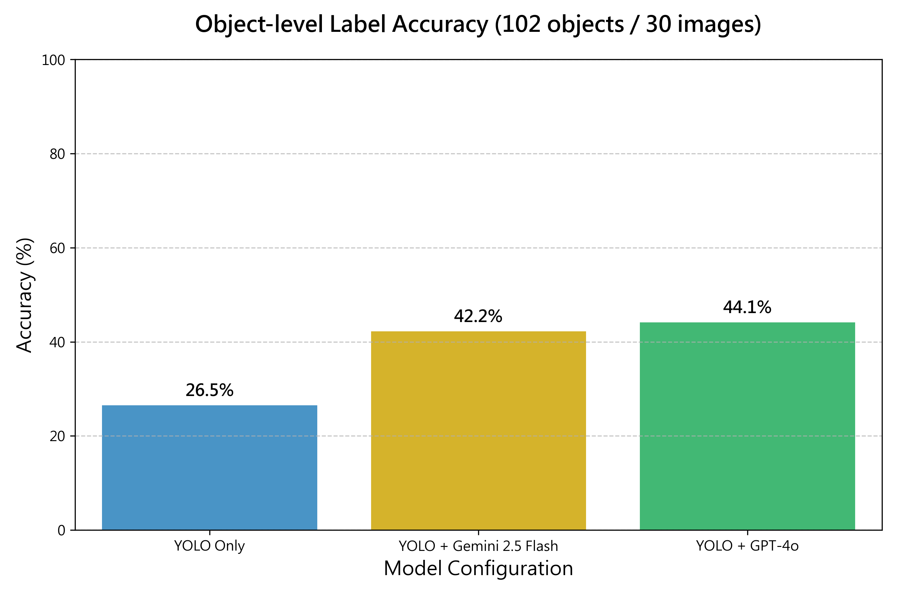
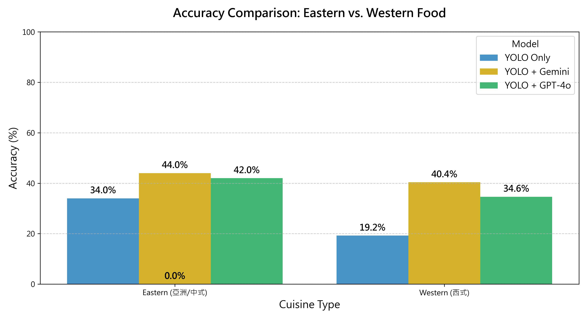

# 實驗評估資料夾 (Experiment Evaluation)

本資料夾用於存放「YOLO vs. YOLO+VLM 協同辨識標籤準確率比較實驗」的所有相關資料。

## 實驗目的

比較「純 YOLO」與「YOLO + VLM 協同架構」在食物標籤辨識上的準確率差異。

VLM 的角色是：對 YOLO **信心度低於 0.70** 的物件進行二次視覺確認，將 YOLO 給出的錯誤標籤更正為正確的食物名稱。

## 資料夾結構

```
experiments/
├── test_images/              # 30 張測試用廚餘照片（必須含圓形餐盤）
├── experiment_results.csv    # 主記錄表：以「物件」為單位記錄辨識結果
├── label_categories.csv      # 廚餘類別定義對照表
└── README.md                 # 本說明文件
```

## 欄位說明 — `experiment_results.csv`

> ⚠️ 評估單位為**物件 (item)**，而非圖片。一張圖若有 3 個食物物件，則對應 3 列資料。

| 欄位 | 說明 | 合法值 |
|---|---|---|
| `image_id` | 所屬圖片編號 | `img_001` ~ `img_030` |
| `item_id` | 物件唯一編號（同圖多物件時遞增）| `img_001_item_01` |
| `image_filename` | 實際檔案名稱（含副檔名）| e.g. `chicken_rice_easy_001.jpg` |
| `scene_difficulty` | 拍攝場景難度 | `easy` / `hard` |
| `ground_truth_label` | 此物件的人工標記正確類別 | e.g. `豬排` |
| `yolo_label` | YOLO 給出的預測標籤 | e.g. `牛排` |
| `yolo_confidence` | YOLO 的信心度分數 | `0.00` ~ `1.00` |
| `vlm_triggered` | 是否觸發了 VLM 二次確認（信心度 < 0.70）| `1` / `0` |
| `vlm_label` | VLM 修正後的最終標籤（未觸發則與 yolo_label 相同）| e.g. `豬排` |
| `yolo_label_correct` | YOLO 標籤是否正確 | `1` (正確) / `0` (錯誤) |
| `vlm_label_correct` | VLM 最終標籤是否正確 | `1` (正確) / `0` (錯誤) |
| `notes` | 備註（光線、遮擋、特殊情況等）| 自由填寫 |

## 照片規範

**所有測試照片必須包含清楚可見的圓形餐盤**，因為系統以餐盤面積為基準推算廚餘比例。

照片命名規則：
```
{主要食物類別_英文}_{場景難度}_{編號}.jpg
```
例如：
- `chicken_rice_easy_001.jpg`
- `mixed_vegetables_hard_003.jpg`

### 建議的 30 張照片分布

| 類型 | 數量 | 場景特性 |
|---|---|---|
| 簡單場景 | 10 張 | 單一食物、光線充足、俯拍清晰 |
| 中等場景 | 10 張 | 2-3 種食物混合、有醬料 |
| 困難場景 | 10 張 | 光線昏暗、食物遮擋、外型相似易混淆 |

## 核心評估指標

本實驗以**物件標籤準確率 (Per-Item Label Accuracy)** 為主要指標：

```
物件標籤準確率 = 標籤正確的物件數 / 被偵測到的總物件數
```

輔助指標：
- **VLM 修正成功率**：`vlm_triggered=1` 的物件中，`vlm_label_correct=1` 的比例
- **YOLO vs VLM 差異**：對 `vlm_triggered=1` 的物件子集，分別計算 YOLO 與 VLM 的準確率

## 統計檢定

- **McNemar's Test**：比較「YOLO 錯但 VLM 對」vs「YOLO 對但 VLM 錯」的數量是否有顯著差異
- 若 **p < 0.05**，代表 VLM 的標籤修正具有統計顯著性

---

## 🛠️ 實驗架構與方法論 (Methodology)

為了解決複雜便當場景下的辨識痛點，我們在此實驗中導入了以下進階 VLM 技巧：

1. **全圖視覺提示 (Visual Prompting - Red Box Context)**
   - **痛點**：將 YOLO 的 bounding box 單純「裁切 (Crop)」出來會導致嚴重失真與失去上下文。
   - **解法**：不進行裁切，改用 Pillow 在**全尺寸原圖**上畫出「紅色粗框」標註低信心的物件位置。讓 VLM 能同時看到「局部特徵」與「全局配菜邏輯」來進行推理。
2. **多標籤輸出 (Multi-Label Classification)**
   - **痛點**：YOLO 的單一預測框經常包住了兩種以上的食物（例如同時框到青椒與肉絲），強制 VLM 單選會導致假陰性 (False Negative)。
   - **解法**：放寬 Prompt 限制，要求 VLM 回傳**所有觀察到的食材清單**（以逗號分隔）。只要其中一個食材命中 Ground Truth 同義詞，即判定修正成功。
3. **思維鏈推理 (Chain-of-Thought, CoT)**
   - **痛點**：VLM 偶爾會發生形狀或顏色相似的嚴重誤判（例如將小番茄看成西瓜、蒸蛋看成豆腐）。
   - **解法**：強制 VLM 在輸出最終 `Items:` 之前，必須先輸出 `Analysis:` 欄位，針對紅框內物品的**顏色、紋理、形狀**進行文字分析，大幅降低低級失誤。

---

## 🏆 最終實驗結果 (Final Results)

基於 30 張測試影像、共計 **102 個 Ground Truth 獨立物件** 進行評估。



| 實驗組別 (Model Configuration) | YOLO 原始準確率 | 經過 VLM 修正後準確率 | 提升幅度 |
|:---|:---:|:---:|:---:|
| **1. YOLO Only (Baseline)** | 26.5% | **26.5%** | - |
| **2. YOLO + Gemini 2.5 Flash** | 26.5% | **42.2%** | `+ 15.7%` |
| **3. YOLO + GPT-4o** | 26.5% | **44.1%** | `+ 17.6%` |

**📌 結論**：
導入「全圖脈絡 + 多標籤 + CoT 思維鏈」的架構後，GPT-4o 成功將準確率推升了 17.6%，證明 VLM 具備極強的視覺糾錯與邏輯推理能力，有效彌補了 YOLO 在遮擋與複雜廚餘場景下的先天劣勢。

---

## 🌍 附加分析：東西方食物的辨識差異 (Cuisine Comparison)

為了進一步了解系統在不同飲食文化下的適應性，我們將 30 張測試影像（共 102 個物件）分類為 **「Eastern (亞洲/中式)」** 與 **「Western (西式)」**，並比較 YOLO 與兩大 VLM 的準確率對比：



| Cuisine Type | 物件數 | YOLO 原始準確率 | YOLO + Gemini 2.5 Flash | YOLO + GPT-4o |
|:---|:---:|:---:|:---:|:---:|
| **Eastern (亞洲/中式)** | 50 | 34.0% | **44.0%** `(+10.0%)` | 42.0% `(+ 8.0%)` |
| **Western (西式)** | 52 | 19.2% | **40.4%** `(+21.2%)` | 34.6% `(+15.4%)` |

### 💡 關鍵發現：
1. **中式食物 Baseline 較高**：YOLO 在中式/亞洲食物上的原始準確率 (34.0%) 顯著高於西式食物 (19.2%)。這可能是因為原始訓練資料集中，對於中式的常見菜色具備較好的特徵捕捉能力。
2. **西式食物的 VLM 救援能力極強**：對於西式食物，YOLO 的表現極度不穩定，但 **VLM 介入後幾乎將準確率翻倍（Gemini 甚至提升了 21.2%）**。這充分展現了 VLM 所蘊含的廣泛世界知識 (World Knowledge) 能有效補足專有模型沒學過的外國菜色盲區。
3. **Gemini 2.5 Flash 表現亮眼**：在導入 CoT 之後，Gemini 2.5 Flash 在東西方菜色的辨識率上**雙雙超越了 GPT-4o**。這可能得益於 Gemini 2.5 針對多模態視覺與在地化食物具備更敏銳的零樣本 (Zero-shot) 推理能力。

